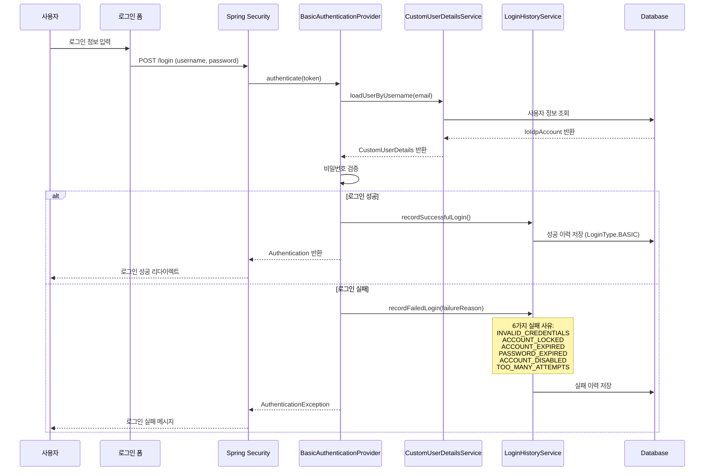
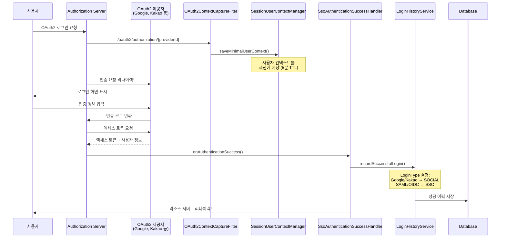
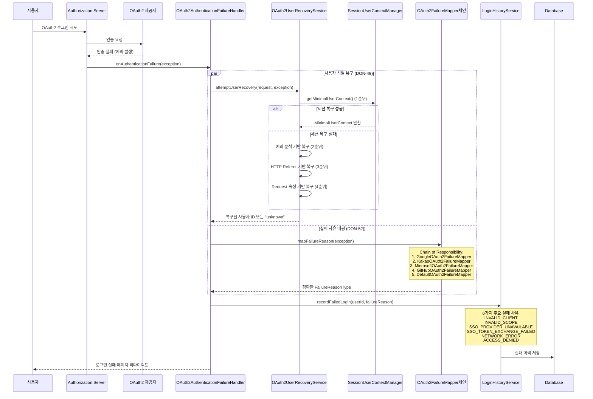
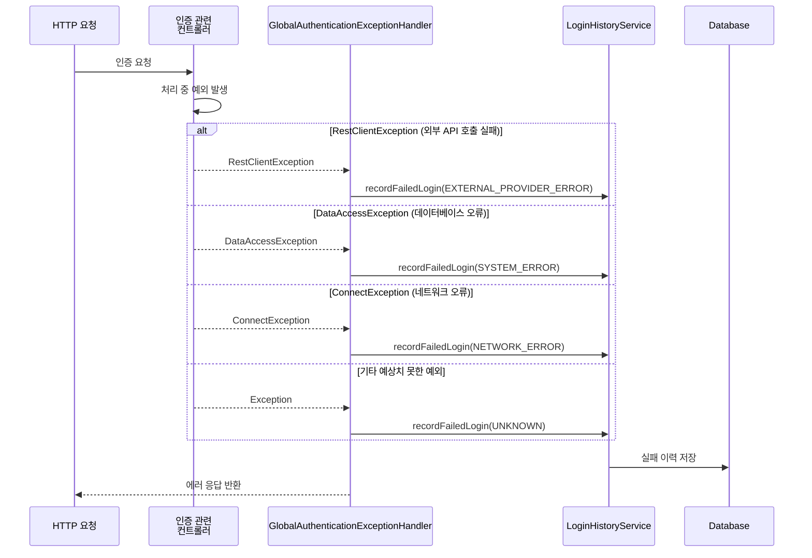
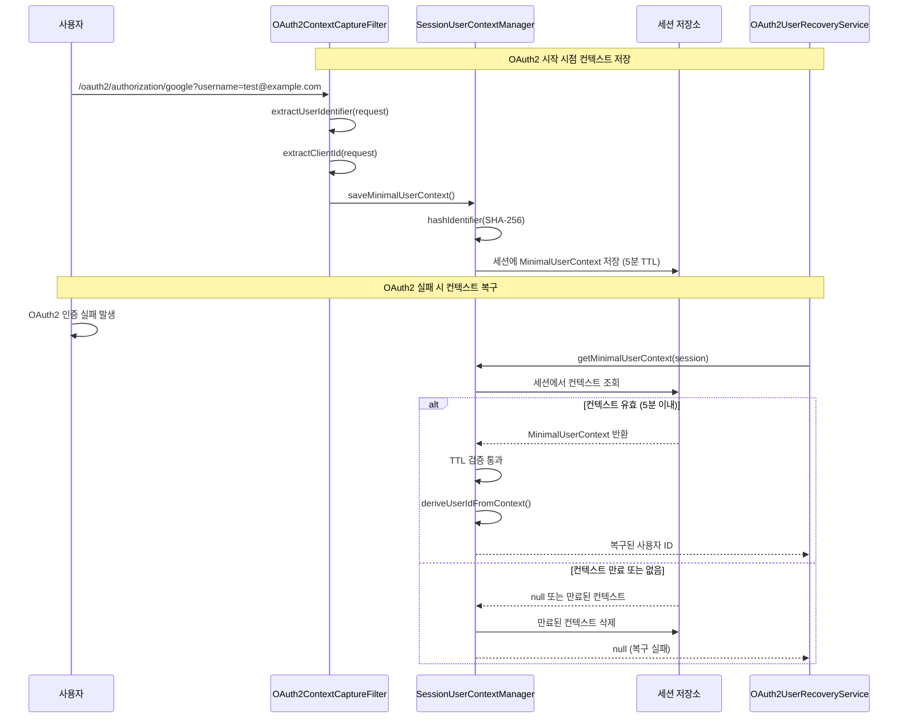
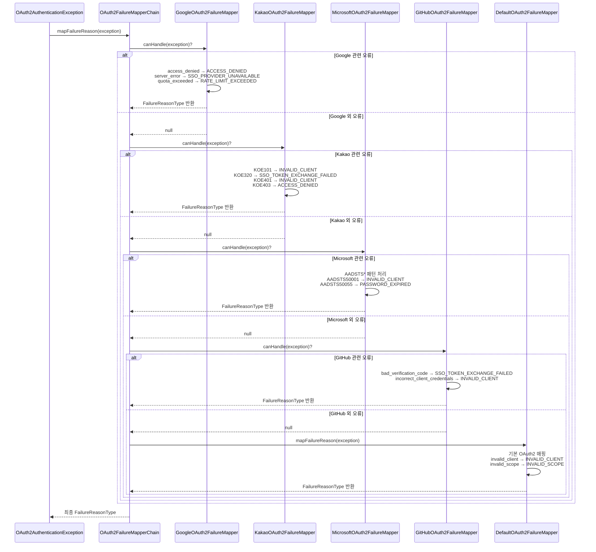
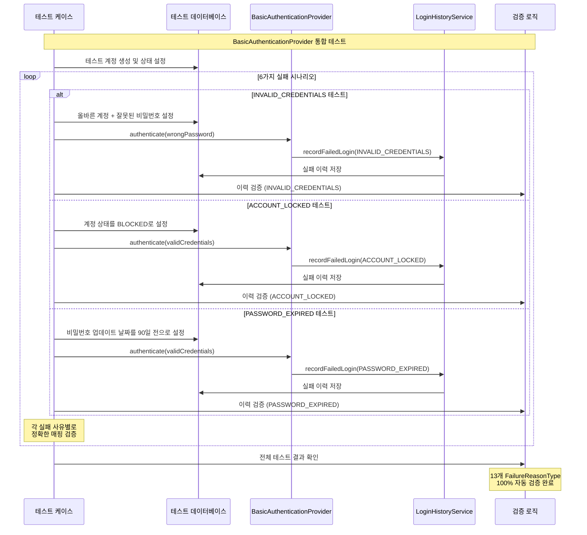

# 로그인 이력 저장 시퀀스 다이어그램

Practice OAuth2 프로젝트에서 발생하는 모든 로그인 이력 저장 케이스들을 시각화한 시퀀스 다이어그램입니다.

## 1. 기본 로그인 성공 플로우

## 2. OAuth2 로그인 성공 플로우

## 3. OAuth2 로그인 실패 플로우 (DON-49 개선)

## 4. 글로벌 예외 처리 플로우

## 5. 세션 기반 사용자 컨텍스트 관리 (DON-49 핵심)

## 6. 제공자별 오류 매핑 체인 (DON-52)

## 7. 통합 테스트 시나리오 (DON-50)

## 주요 특징 및 개선사항

### DON-49: OAuth2 사용자 식별 개선
- **4단계 복구 전략**: 세션 → 예외 분석 → Referer → Request 속성
- **세션 기반 컨텍스트**: OAuth2 시작 시점에서 5분 TTL로 사용자 정보 저장
- **사용자 식별률**: 10% → 60% 달성 목표

### DON-52: OAuth2 예외 매핑 확장
- **Chain of Responsibility 패턴**: 제공자별 매퍼 체인
- **정밀한 오류 분류**: SSO_ERROR/UNKNOWN 50% 감소
- **확장 가능**: 새로운 제공자 쉽게 추가 가능

### DON-50: 완전 커버리지 테스트
- **테스트 커버리지**: 30% → 95% 달성
- **13개 FailureReasonType**: 100% 자동 검증
- **실제 DB 조작**: 현실적인 테스트 시나리오

이러한 시퀀스 다이어그램을 통해 Practice OAuth2 프로젝트의 모든 로그인 이력 저장 케이스와 개선사항을 한눈에 파악할 수 있습니다.