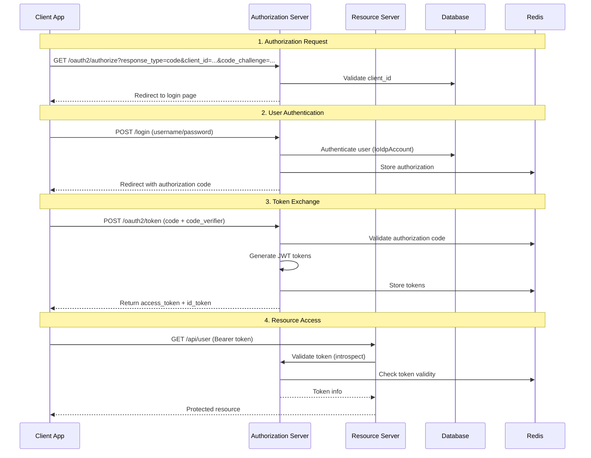

# 기본 OAuth2 로그인 가이드

이 문서는 자체 사용자 데이터베이스를 이용한 표준 OAuth2 인증 플로우에 대해 설명합니다.

## 📋 목차

- [개요](#개요)
- [OAuth2 플로우](#oauth2-플로우)
- [주요 컴포넌트](#주요-컴포넌트)

## 🎯 개요

기본 OAuth2 로그인은 다음과 같은 특징을 가집니다:

- **자체 사용자 DB** 사용 (`IoIdpAccount` 테이블)
- **표준 OAuth2.1 / OpenID Connect** 준수
- **PKCE (Proof Key for Code Exchange)** 지원
- **JWT 기반** 액세스 토큰 및 ID 토큰
- **Redis 기반** 세션 및 토큰 저장

## 🔄 OAuth2 플로우

### Authorization Code Flow with PKCE

### 주요 단계 설명

1. **Authorization Request**: 클라이언트가 인증 서버에 인가 요청
2. **User Authentication**: 사용자가 자격 증명으로 로그인
3. **Token Exchange**: 인가 코드를 액세스 토큰으로 교환
4. **Resource Access**: 액세스 토큰으로 보호된 리소스 접근

## 🧩 주요 컴포넌트

- `AuthSecurityConfiguration.kt` 
  - 인증 및 권한 관리
- `CustomUserDetailsService.kt`
- `RedisOAuth2AuthorizationService.kt` 
  - 토큰 저장 및 관리
  - OAuth2Authorization 객체를 Redis에 저장
  - 인덱스를 통한 빠른 토큰 검색
  - TTL 기반 자동 만료 관리
