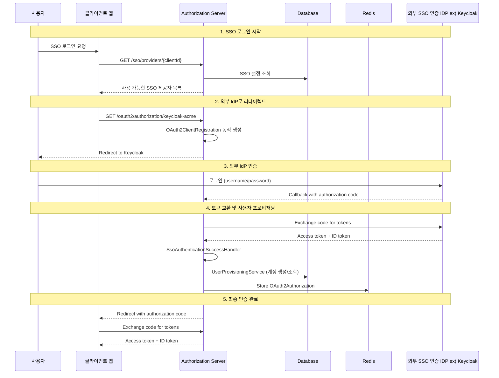

# SSO 통합 가이드

이 문서는 외부 Identity Provider(IdP)와의 Single Sign-On(SSO) 통합에 대해 설명합니다.

## 📋 목차

- [개요](#개요)
- [SSO 아키텍처](#sso-아키텍처)
- [지원 제공자](#지원-제공자)
- [핵심 컴포넌트](#핵심-컴포넌트)
- [Keycloak 연동](#keycloak-연동)
- [사용자 프로비저닝](#사용자-프로비저닝)
- [설정 관리](#설정-관리)
- [프론트엔드 통합](#프론트엔드-통합)
- [트러블슈팅](#트러블슈팅)

## 🎯 개요

SSO 통합을 통해 사용자는 외부 IdP의 자격 증명으로 우리 시스템에 로그인할 수 있습니다. 이는 다음과 같은 이점을 제공합니다:

- **사용자 편의성**: 별도 계정 생성 불필요
- **보안 강화**: 중앙화된 인증 관리
- **관리 효율성**: 통합된 사용자 관리
- **기업 환경 지원**: 기존 Active Directory/LDAP 활용

## 🏗️ SSO 아키텍처

### 전체 흐름도



### 핵심 플로우

1. **SSO 제공자 목록 조회**: 클라이언트별로 설정된 SSO 제공자 조회
2. **동적 클라이언트 등록**: 런타임에 OAuth2 클라이언트 설정 생성
3. **외부 IdP 인증**: 사용자가 Keycloak 등에서 로그인
4. **사용자 프로비저닝**: 외부 사용자 정보를 기반으로 내부 계정 생성/연결
5. **세션 관리**: Redis에 인증 정보 저장 및 관리

## 주요 컴포너트
- `IoIdpShoplClientSsoSetting.kt` - SSO 설정 관리
- `DynamicClientRegistrationService.kt` - 동적 클라이언트 등록
- `UserProvisioningService.kt` - 사용자 프로비저닝
    - 이메일 기반 매칭
        ```kotlin
        // 이메일이 일치하는 기존 계정이 있으면 연결
        val existingAccount = if (email != null) {
            accountRepository.findByShoplClientIdAndEmail(shoplClientId, email)
        } else null
        
        if (existingAccount != null) {
            // OAuth 연결 추가
            createOAuthLink(existingAccount, oauth2User, ...)
            return existingAccount
        }
        ```
    - 자동 계정 생성
        ```kotlin
        private fun createNewAccount(
            shoplClientId: String,
            email: String?,
            name: String?,
            ssoSettings: IoIdpShoplClientSsoSetting
        ): IoIdpAccount {
            val accountId = generateAccountId()
            val now = LocalDateTime.now()
        
            val account = IoIdpAccount(
                id = accountId,
                shoplClientId = shoplClientId,
                shoplUserId = generateKey(),
                shoplLoginId = generateKey(),
                email = email,
                phone = null,
                name = name,
                pwd = null,  // SSO 사용자는 비밀번호 없음
                isTempPwd = false,
                pwdUpdateDt = null,
                status = "ACTIVE",
                isCertEmail = email != null,
                regDt = now,
                modDt = now,
                delDt = null
            )
        
            return accountRepository.save(account)
        }
        ```
    - OAuth 연결 정보 저장
      ```kotlin
      private fun createOAuthLink(
          account: IoIdpAccount,
          oauth2User: OAuth2User,
          shoplClientId: String,
          providerType: ProviderType,
          providerUserId: String,
          email: String?,
          name: String?
      ): IoIdpAccountOauthLink {
          val now = LocalDateTime.now()
          val rawClaims = serializeOAuth2Attributes(oauth2User.attributes)
      
          val oauthLink = IoIdpAccountOauthLink(
              id = generateKey(),
              accountId = account.id,
              shoplClientId = shoplClientId,
              providerType = providerType,
              providerUserId = providerUserId,
              emailAtProvider = email,
              nameAtProvider = name,
              rawClaims = rawClaims,  // 전체 클레임 정보 JSON으로 저장
              regDt = now,
              modDt = now
          )
      
          return oauthLinkRepository.save(oauthLink)
      }
      ```
  - 사용자 정보 추출. 다양한 제공자별로 사용자 정보를 추출하는 로직:
    ```kotlin
    private fun extractProviderUserId(oauth2User: OAuth2User, providerType: ProviderType): String {
        return when (providerType) {
            ProviderType.GOOGLE -> oauth2User.getAttribute<String>("sub") 
                ?: oauth2User.getAttribute<String>("id") 
                ?: throw IllegalArgumentException("Google user ID not found")
                
            ProviderType.KAKAO -> oauth2User.getAttribute<Any>("id")?.toString() 
                ?: throw IllegalArgumentException("Kakao user ID not found")
                
            ProviderType.NAVER -> {
                val response = oauth2User.getAttribute<Map<String, Any>>("response")
                response?.get("id")?.toString() 
                    ?: throw IllegalArgumentException("Naver user ID not found")
            }
            
            ProviderType.MICROSOFT -> oauth2User.getAttribute<String>("oid") 
                ?: oauth2User.getAttribute<String>("id") 
                ?: throw IllegalArgumentException("Microsoft user ID not found")
                
            ProviderType.OIDC -> oauth2User.getAttribute<String>("sub") 
                ?: throw IllegalArgumentException("OIDC user ID not found")
                
            // ... 기타 제공자들
        }
    }
    
    private fun extractEmail(oauth2User: OAuth2User): String? {
        return oauth2User.getAttribute<String>("email")
            ?: oauth2User.getAttribute<String>("mail")
            ?: oauth2User.getAttribute<Map<String, Any>>("response")?.get("email")?.toString()
    }
    
    private fun extractName(oauth2User: OAuth2User): String? {
        return oauth2User.getAttribute<String>("name")
            ?: oauth2User.getAttribute<String>("given_name")
            ?: oauth2User.getAttribute<String>("nickname")
            ?: oauth2User.getAttribute<Map<String, Any>>("response")?.get("name")?.toString()
    }
    ``` 
- `SsoAuthenticationSuccessHandler.kt` - SSO 인증 성공 핸들러