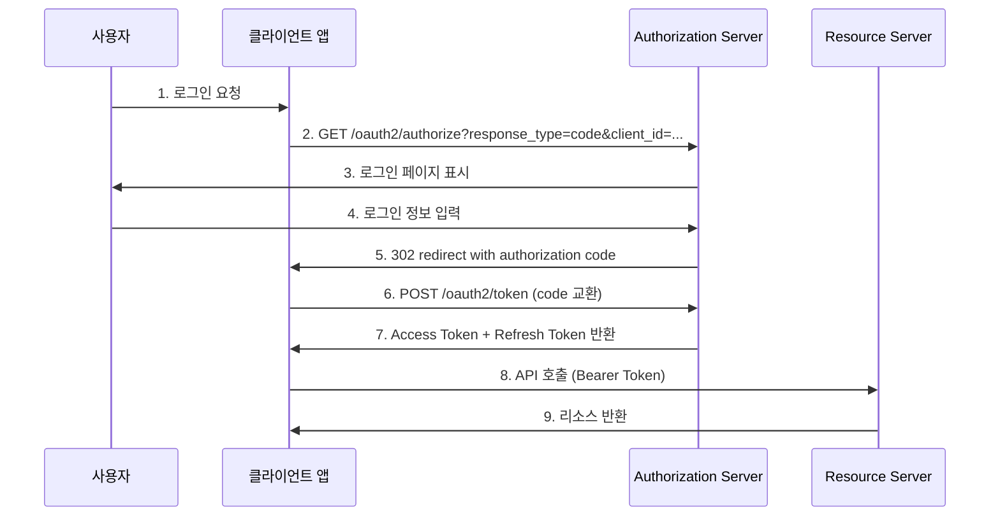
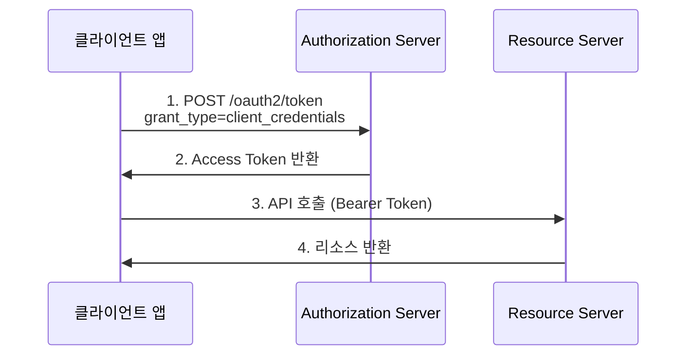
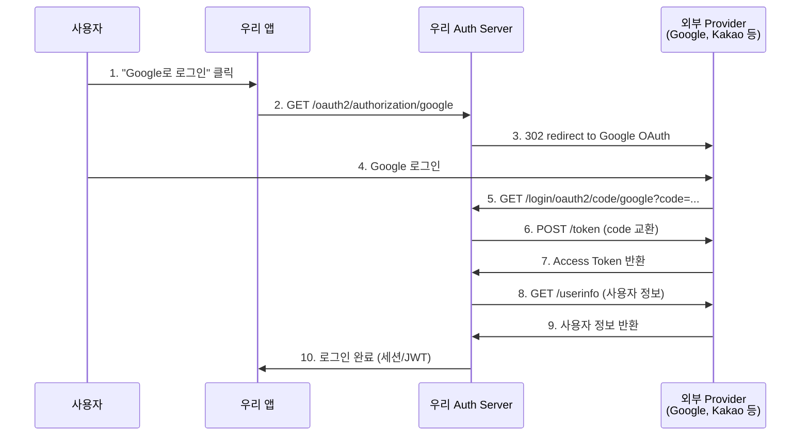

# Spring OAuth2 엔드포인트 가이드

## 주요 엔드포인트 개요

| 엔드포인트 | 용도 | 사용 시점 |
|-----------|------|----------|
| `/oauth2/authorize` | Authorization Code 요청 | 사용자 인증 시작 |
| `/oauth2/token` | Access Token 발급/갱신 | 토큰 교환 시 |
| `/oauth2/authorization/{client_id}` | OAuth2 클라이언트별 인증 시작 | 특정 클라이언트 로그인 |
| `/login/oauth2/code/{client_id}` | Authorization Code 콜백 처리 | 외부 OAuth2 Provider 콜백 |

## 시나리오별 시퀀스 다이어그램

### 1. Authorization Code Flow (서버가 Authorization Server 역할)



### 2. Client Credentials Flow



### 3. Federated Identity (서버가 OAuth2 Client 역할)



## 엔드포인트 상세 설명

### `/oauth2/authorize`
- **목적**: Authorization Code Grant의 첫 번째 단계
- **HTTP Method**: GET
- **주요 파라미터**:
    - `response_type=code`
    - `client_id`: 클라이언트 식별자
    - `redirect_uri`: 콜백 URL
    - `scope`: 요청 권한 범위
    - `state`: CSRF 방지용 랜덤 값
- **응답**: 사용자 로그인 페이지 또는 authorization code와 함께 redirect

### `/oauth2/token`
- **목적**: 토큰 발급 및 갱신
- **HTTP Method**: POST
- **Grant Types**:
    - `authorization_code`: Authorization Code를 Access Token으로 교환
    - `refresh_token`: Refresh Token으로 새 Access Token 발급
    - `client_credentials`: 클라이언트 자격 증명으로 토큰 발급
- **응답**: Access Token, Refresh Token, 만료 시간 등

### `/oauth2/authorization/{client_id}`
- **목적**: 특정 OAuth2 Provider로의 로그인 시작점
- **HTTP Method**: GET
- **사용 사례**:
    - "Google로 로그인", "Kakao로 로그인" 등의 소셜 로그인
    - Federated Identity 구현 시 사용
- **동작**: 해당 Provider의 OAuth2 authorization URL로 redirect

### `/login/oauth2/code/{client_id}`
- **목적**: 외부 OAuth2 Provider로부터의 콜백 처리
- **HTTP Method**: GET
- **파라미터**:
    - `code`: Authorization Code
    - `state`: CSRF 방지용 값
- **동작**:
    1. Authorization Code를 Access Token으로 교환
    2. 사용자 정보 조회
    3. 내부 사용자 계정과 연동
    4. 세션 생성 또는 JWT 발급

## 구성 예시

### application.yml 설정
```yaml
spring:
  security:
    oauth2:
      client:
        registration:
          google:
            client-id: ${GOOGLE_CLIENT_ID}
            client-secret: ${GOOGLE_CLIENT_SECRET}
            scope: openid,email,profile
            redirect-uri: "{baseUrl}/login/oauth2/code/google"
          kakao:
            client-id: ${KAKAO_CLIENT_ID}
            client-secret: ${KAKAO_CLIENT_SECRET}
            authorization-grant-type: authorization_code
            redirect-uri: "{baseUrl}/login/oauth2/code/kakao"
        provider:
          kakao:
            authorization-uri: https://kauth.kakao.com/oauth/authorize
            token-uri: https://kauth.kakao.com/oauth/token
            user-info-uri: https://kapi.kakao.com/v2/user/me
```

## 보안 고려사항

1. **CSRF 공격 방지**: `state` 파라미터 사용
2. **Authorization Code 탈취 방지**: PKCE (Proof Key for Code Exchange) 적용
3. **Redirect URI 검증**: 등록된 URI만 허용
4. **HTTPS 강제**: 모든 OAuth2 통신은 HTTPS 사용
5. **토큰 만료 시간**: 적절한 Access Token 및 Refresh Token 만료 시간 설정