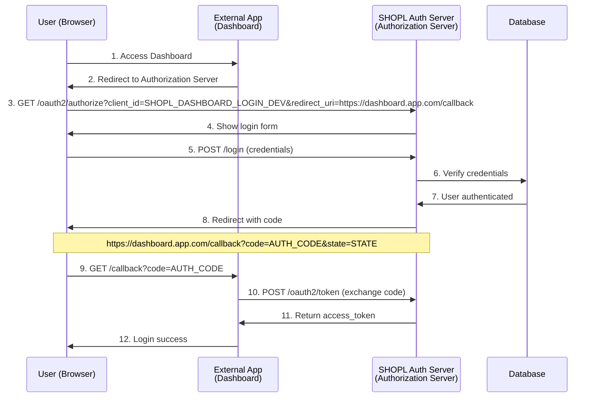
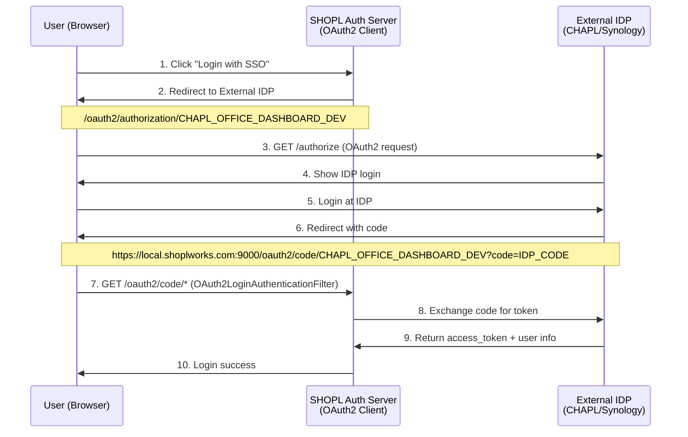

# OAuth2 Flow Analysis

## OAuth2 Flow

### Case 1: Authorization Server로서 외부 클라이언트에게 코드 발급

```mermaid
sequenceDiagram
    participant User as User (Browser)
    participant ExtApp as External App<br/>(Dashboard)
    participant AuthServer as SHOPL Auth Server<br/>(Authorization Server)
    participant DB as Database

    User->>ExtApp: 1. Access Dashboard
    ExtApp->>User: 2. Redirect to Authorization Server
    User->>AuthServer: 3. GET /oauth2/authorize?client_id=SHOPL_DASHBOARD_LOGIN_DEV&redirect_uri=https://dashboard.app.com/callback
    AuthServer->>User: 4. Show login form
    User->>AuthServer: 5. POST /login (credentials)
    AuthServer->>DB: 6. Verify credentials
    DB->>AuthServer: 7. User authenticated
    AuthServer->>User: 8. Redirect with code
    Note over User,AuthServer: https://dashboard.app.com/callback?code=AUTH_CODE&state=STATE
    User->>ExtApp: 9. GET /callback?code=AUTH_CODE
    ExtApp->>AuthServer: 10. POST /oauth2/token (exchange code)
    AuthServer->>ExtApp: 11. Return access_token
    ExtApp->>User: 12. Login success
```

### Case 2: OAuth2 Client로서 외부 IDP와 연동 :: Federated login

```mermaid
sequenceDiagram
    participant User as User (Browser)
    participant AuthServer as SHOPL Auth Server<br/>(OAuth2 Client)
    participant ExternalIDP as External IDP<br/>(CHAPL/Synology)

    User->>AuthServer: 1. Click "Login with SSO"
    AuthServer->>User: 2. Redirect to External IDP
    Note over User,AuthServer: /oauth2/authorization/CHAPL_OFFICE_DASHBOARD_DEV
    User->>ExternalIDP: 3. GET /authorize (OAuth2 request)
    ExternalIDP->>User: 4. Show IDP login
    User->>ExternalIDP: 5. Login at IDP
    ExternalIDP->>User: 6. Redirect with code
    Note over User,ExternalIDP: https://local.shoplworks.com:9000/oauth2/code/CHAPL_OFFICE_DASHBOARD_DEV?code=IDP_CODE
    User->>AuthServer: 7. GET /oauth2/code/* (OAuth2LoginAuthenticationFilter)
    AuthServer->>ExternalIDP: 8. Exchange code for token
    ExternalIDP->>AuthServer: 9. Return access_token + user info
    AuthServer->>User: 10. Login success
```